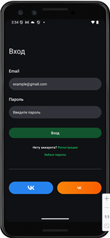
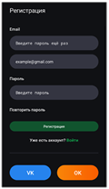
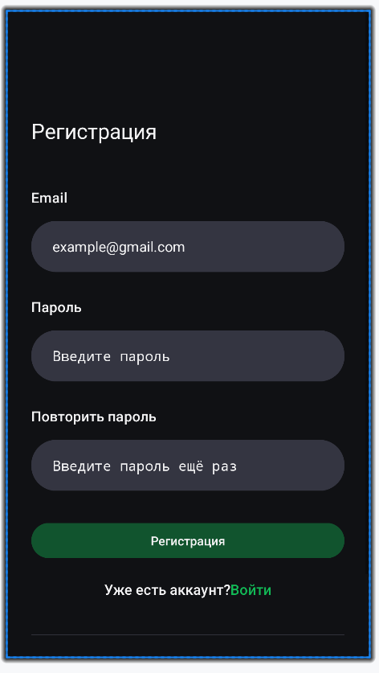
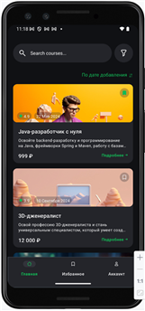
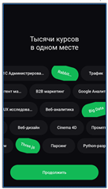
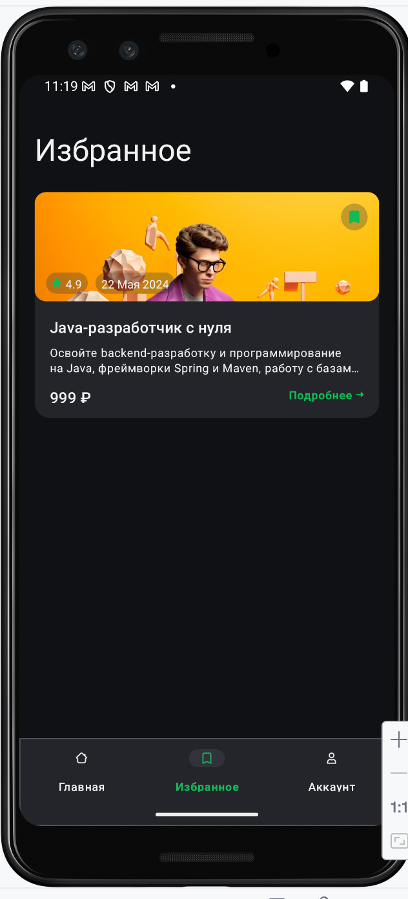
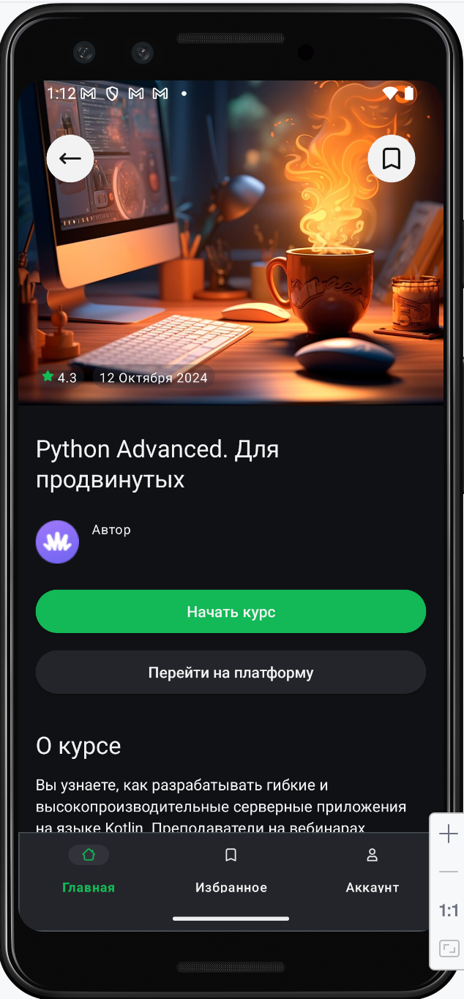
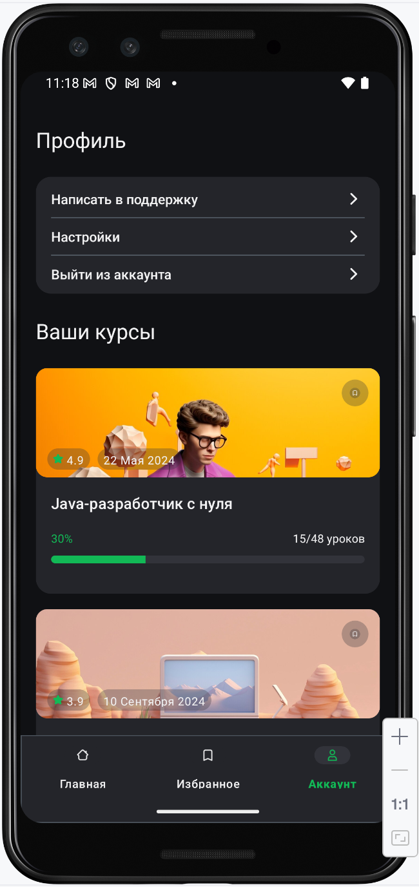
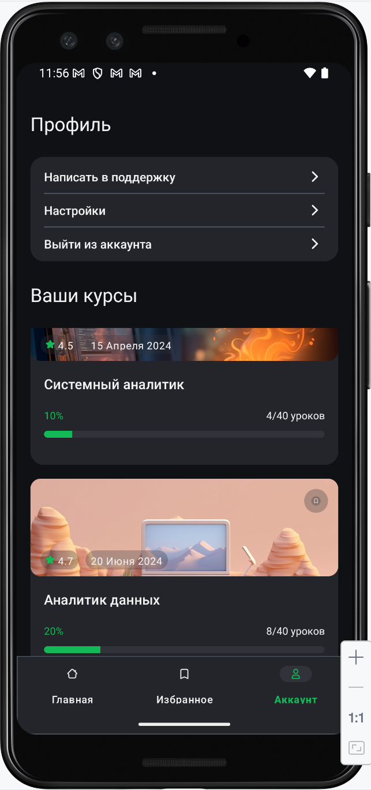

# 📱 CoursesApp

Android-приложение для просмотра и управления онлайн-курсами, реализованное по техническому заданию.  
Проект выполнен с использованием **многомодульной архитектуры, Clean Architecture и MVVM**, с полной синхронизацией данных между экранами.

---

# 📸 Скриншоты

`screenshots/`

<table>
  <tr>
    <td width="50%" valign="top">

## 🔐 Вход и регистрация

| Вход | Регистрация |
|------|-------------|
|  |  |

| Регистрация (состояние) |
|-------------------------|
|  |

  </td>
    <td width="50%" valign="top">

## 🏠 Главный экран

| Главный экран |
|---------------|
|  |

## 🚀 Онбординг

| Онбординг |
|-----------|
|  |

  </td>
  </tr>

  <tr>
    <td width="50%" valign="top">

## ❤️ Избранное

| Состояние 1 | Состояние 2 |
|------------|-------------|
|  |  |

  </td>
    <td width="50%" valign="top">

## 📄 Экран курса

| Состояние 1 | Состояние 2 |
|------------|-------------|
|  |  |

  </td>
  </tr>

  <tr>
    <td width="50%" valign="top">

## 👤 Профиль

| Состояние 1 | Состояние 2 |
|------------|-------------|
|  |  |

  </td>
    <td width="50%" valign="top">

## 📌 Примечание

Скриншоты демонстрируют разные состояния экранов:
- авторизация
- регистрация
- список курсов
- избранное
- экран курса
- профиль
- онбординг

  </td>
  </tr>
</table>

---

# 📄 Реализованный функционал

<table>
  <tr>
    <td width="50%" valign="top">

## 🔐 Экран входа (Enter)

✔ Валидация email (`text@text.text`)  
✔ Запрет кириллицы  
✔ Кнопка активна только при валидных данных  
✔ Переход на главный экран  
✔ VK → [vk.com](https://vk.com/)  
✔ OK → [ok.ru](https://ok.ru/)  

  </td>
    <td width="50%" valign="top">

## 🏠 Главный экран (Main)

✔ Загрузка курсов из JSON API  
✔ Отображение списка курсов  
✔ Обрезка описания до 2 строк  
✔ Сортировка по `publishDate`  
✔ Работа с избранным (bookmark)  
✔ Переход на экран курса  

  </td>
  </tr>

  <tr>
    <td width="50%" valign="top">

## ❤️ Избранное (Favorite)

✔ Показывает только избранные курсы  
✔ Удаление курса сразу из списка  
✔ Полная синхронизация состояния  

  </td>
    <td width="50%" valign="top">

## 📄 Экран курса (Course)

✔ Открывается по `courseId`  
✔ Данные соответствуют выбранному курсу  
✔ Bookmark синхронизирован с системой  

  </td>
  </tr>

  <tr>
    <td width="50%" valign="top">

## 👤 Профиль (Profile)

✔ Экран аккаунта  
✔ Список курсов с прогрессом  
✔ Работа с избранным  

  </td>
    <td width="50%" valign="top">

## ℹ️ Дополнительно

✔ Реализованы все экраны, включая те, которые не требовались по ТЗ  
✔ Добавлены onboarding и расширенный profile  
✔ UI соответствует макету  

  </td>
  </tr>
</table>

---

# 🧠 Архитектура

Проект реализован как **многомодульное приложение**:

```text
CoursesApp/
├── app/
├── core-ui/
├── data/
├── domain/
├── feature_auth/
├── feature_course/
├── feature_favorite/
├── feature_main/
├── feature_profile/
├── feature_onboarding/
└── settings.gradle.kts
````

<table>
  <tr>
    <td width="50%" valign="top">

## 📦 Domain слой

```text
domain/
├── model/
│   └── Course.kt
├── repository/
│   └── CoursesRepository.kt
└── usecase/
    ├── GetCoursesUseCase.kt
    ├── GetFavoriteCoursesUseCase.kt
    └── ToggleFavoriteUseCase.kt
```

✔ Бизнес-логика
✔ Интерфейсы
✔ UseCases

  </td>
    <td width="50%" valign="top">

## 📦 Data слой

```text
data/
├── remote/
│   ├── api/
│   │   └── CoursesApi.kt
│   ├── dto/
│   │   ├── CourseDto.kt
│   │   └── CoursesResponseDto.kt
│   └── mapper/
│       └── CourseMapper.kt
├── repository/
│   └── CoursesRepositoryImpl.kt
└── di/
    └── DataModule.kt
```

✔ Retrofit API
✔ DTO + Mapper
✔ Repository
✔ DI

  </td>
  </tr>

  <tr>
    <td width="50%" valign="top">

## 📦 Feature модули

```text
feature_auth/       → Вход
feature_main/       → Главный экран
feature_favorite/   → Избранное
feature_course/     → Курс
feature_profile/    → Профиль
feature_onboarding/ → Онбординг
```

✔ Feature-based архитектура
✔ Изоляция экранов
✔ Свои presentation-слои

  </td>
    <td width="50%" valign="top">

## 📦 App модуль

```text
app/
├── App.kt
├── MainActivity.kt
└── di/
    └── AppModule.kt
```

✔ Навигация
✔ DI
✔ Запуск приложения

  </td>
  </tr>

  <tr>
    <td width="50%" valign="top">

## 📦 Core UI модуль

```text
core-ui/
└── ui/
    └── UiText.kt
```

✔ Общие UI-типы
✔ Переиспользуемые обёртки для строк
✔ Независимость ViewModel от Context

  </td>
    <td width="50%" valign="top">

## 📌 Принцип разделения

```text
domain     → бизнес-логика
data       → API / БД / repository
feature_*  → экраны и presentation
app        → точка входа
core-ui    → общие UI-утилиты
```

✔ Масштабируемость
✔ Чёткое разделение ответственности
✔ Удобство поддержки

  </td>
  </tr>
</table>

---

# 🌐 Работа с данными

> Сетевой слой реализован через Retrofit + OkHttp + CoursesApi.
> Для стабильной демонстрации добавлен fallback на локальный mock JSON (`assets/courses.json`), полностью повторяющий структуру ответа mock API из ТЗ.
> Избранное хранится локально через Room.
> Архитектура: многомодульная, MVVM, Clean Architecture.
> UI реализован на XML.

---

<table>
  <tr>
    <td width="50%" valign="top">

# 🛠️ Технологии

* Kotlin

* XML

* MVVM

* Clean Architecture

* Koin

* Retrofit

* OkHttp

* Room

* Coroutines + Flow

* Navigation Component

  </td>
    <td width="50%" valign="top">

# ⭐ Избранное (hasLike)

В API используется поле:

```kotlin
hasLike: Boolean
```

В UI оно реализовано как **bookmark (флажок)**:

* `true` → зелёный, курс в избранном
* `false` → пустой bookmark

📌 Это **не лайк**, а именно **избранное**

  </td>
  </tr>
</table>

---

<table>
  <tr>
    <td width="50%" valign="top">

# 🔄 Синхронизация

Состояние избранного единое для всех экранов:

* Main
* Favorite
* Profile
* Course

✔ Изменение в одном месте обновляет всё приложение

  </td>
    <td width="50%" valign="top">

# 💾 Хранение

* Курсы → API / mock JSON
* Избранное → Room
* Состояние сохраняется после перезапуска

  </td>
  </tr>

</table>

---

# 🧪 Проверенные сценарии

<table>
  <tr>
    <td width="50%" valign="top">

✔ Добавление в избранное
✔ Удаление
✔ Синхронизация

  </td>
    <td width="50%" valign="top">

✔ Сортировка
✔ Открытие конкретного курса
✔ Перезапуск приложения

  </td>
  </tr>
</table>

---

# 📌 Соответствие ТЗ

✔ Все обязательные экраны реализованы
✔ Стек технологий соблюдён
✔ Данные загружаются из API
✔ Локальное хранение избранного реализовано
✔ UI соответствует макету
✔ Многомодульность соблюдена

---

<table>
  <tr>
    <td width="50%" valign="top">

# 💬 Комментарий разработчика

Проект реализован с упором на:

* чистую архитектуру
* разделение ответственности
* масштабируемость
* синхронизацию состояния
* соответствие production-подходам

  </td>
    <td width="50%" valign="top">

# 📬 Итог

Приложение демонстрирует:

* работу с API
* локальное хранение
* архитектуру
* UI по макету
* синхронизацию данных

  </td>
  </tr>

</table>

---

# 🔍 Code Review Notes

В рамках выполнения тестового задания были получены замечания. Ниже приведены исправления и пояснения по архитектурным решениям.

---

## ✅ Исправлено

### 🔧 Конфигурация API

* `BASE_URL` вынесен в `BuildConfig`
* `MOCK_FILE_ID` вынесен в `BuildConfig`

```kotlin
buildConfigField("String", "BASE_URL", "\"https://drive.usercontent.google.com/\"")
buildConfigField("String", "MOCK_FILE_ID", "\"15arTK7XT2b7Yv4BJsmDctA4Hg-BbS8-q\"")
```

👉 Конфигурация больше не захардкожена в коде и может централизованно изменяться.

---

### 🔧 Fallback стратегия

Fallback на локальный mock JSON сохранён, но сделан **явным и управляемым**:

```kotlin
buildConfigField("boolean", "USE_LOCAL_FALLBACK", "true")
```

```kotlin
try {
    api.getCourses()
} catch (e: Exception) {
    if (BuildConfig.USE_LOCAL_FALLBACK) {
        mockDataSource.getCourses()
    } else {
        throw e
    }
}
```

👉 Это позволяет:

* гарантировать стабильную демонстрацию проекта
* явно контролировать поведение (включить/выключить fallback)

---

### 🔧 Работа со строками

Вынесен общий механизм обработки текста в модуль `core-ui`:

```kotlin
sealed interface UiText {
    data class DynamicString(val value: String) : UiText
    data class StringResource(@StringRes val resId: Int) : UiText
}
```

👉 Это позволяет:

* не привязывать ViewModel к Android Context
* использовать `StringResource` для локализации
* сохранить чистоту архитектуры

---

### 🔧 DI (Dependency Injection)

* устранено дублирование UseCase
* UseCase объявлены в одном DI-модуле

---

## 💡 Архитектурные решения (осознанно оставлено)

### 🧭 Navigation

Navigation Graph в проекте **присутствует и используется**:

* `NavHostFragment`
* `NavController`
* `nav_graph.xml`

Навигация из feature-модулей вынесена в интерфейсы:

```kotlin
interface MainNavigation
interface FavoriteNavigation
```

👉 Это позволяет:

* не связывать feature-модули с Activity
* не зависеть от конкретной реализации `NavController`
* соблюдать принципы Clean Architecture

Переходы выполняются через:

```kotlin
navController.navigate(R.id.courseFragment, bundle)
```

👉 Использование `destination id` является допустимым способом работы с Navigation Component.

Использование `actions` в `nav_graph.xml` возможно как улучшение,
но не является обязательным требованием.

---

### 🖼️ Работа с изображениями

В предоставленном API отсутствует поле изображения:

```json
{
  "id": 100,
  "title": "...",
  ...
}
```

👉 Поэтому выбор drawable выполняется на стороне клиента.

Используется сопоставление по `course.id`:

```kotlin
when (course.id) {
    ...
}
```

👉 Данное решение:

* соответствует ТЗ
* оправдано отсутствием данных в API
* не ограничивает масштабирование

При наличии `image` в API может быть заменено на:

* map
* или загрузку через Coil/Glide

---

## 📌 Итог

Проект реализован с учётом:

* Clean Architecture
* MVVM
* многомодульной структуры
* масштабируемости

Часть замечаний была исправлена,
часть решений оставлена осознанно, исходя из требований ТЗ и архитектурных принципов.

---

## 👨‍💻 Автор

**Amanzhol Aimov**

---

## 🚀 Спасибо за просмотр

Увидел ТЗ, подумал: *“2 часа работы”* 😄
По факту вышло 2 дня, зато было много кайфа. Спасибо Андроиду 💚
Улучшение типа стринги вынести в ресурсы и все прочие в сумме максимум: ~ 10-20 минут

Если проект был полезен или интересен — поставь ⭐ репозиторию 😊
